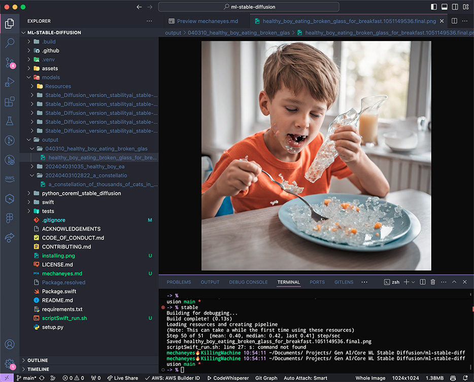

*PROMPT="healthy boy eating broken glass for breakfast"*<br>
*hat tip to the chairman, bruce sterling*

<br>

# But ... why this thing is?

In this eposode I'm getting Stable Diffusion running locally on my M2 Max.

I've been using Stable Diffusion in various ways on my gaming pc, Oobii, which is powered by a 4090. Pretty fun there as is.

Running locally will allow me to take this on the road. I'm starting to do events again (as of Wednesday, 03 Apr 2024 09.04.53 AM EDT) and while I've been using https://dots.party/ to get me warmed up, my idea of leveling up would be to finally integrate TouchDesigner into my workflow. I've seen people marrying the two and I'm very much inspired. Making that happen in a remote/mobile context necessitates getting SDXL up and running on KillingMachine, the M2 laptop. 

TouchDesigner is a whole other beast that I've only started to tap into. As is always the case, forever learning. That's exactly the way I like it.

<br>

# Installing

## Docs

- https://github.com/apple/ml-stable-diffusion
  - Commands below are adapted from apple's readme
- https://github.com/huggingface/blog/blob/main/stable-diffusion-xl-coreml.md
- https://huggingface.co/apple/coreml-stable-diffusion-xl-base
- https://huggingface.co/blog/diffusers-coreml

<br>

## Packages

"Packages? We ain't got no packages! We don't need no packages! I don't have to show you any stinking packages!"

Wrong again, Gold Hat. Install them:

```bash
pip install -r requirements.txt
```

## Model Conversion

https://github.com/apple/ml-stable-diffusion?tab=readme-ov-file#model-conversion

Edited for my use:

```bash
python -m python_coreml_stable_diffusion.torch2coreml \
  --convert-unet \
  --convert-vae-decoder \
  --convert-text-encoder \
  --xl-version \
  --model-version stabilityai/stable-diffusion-xl-base-1.0 \
  --refiner-version stabilityai/stable-diffusion-xl-refiner-1.0 \
  --bundle-resources-for-swift-cli \
  --attention-implementation ORIGINAL \
  -o models
```

This required specific attention:

- `--attention-implementation`: `ORIGINAL` is recommended for cpuAndGPU for deployment on Mac
- `--attention-implementation`: `SPLIT_EINSUM` is recommended for cpuAndNeuralEngine for deployment on iPhone & iPad
- `--attention-implementation`: `SPLIT_EINSUM_V2` is not recommended for Stable Diffusion XL because of prohibitively long compilation time

<br>

# Inference 

https://github.com/apple/ml-stable-diffusion?tab=readme-ov-file#swift-inference

## Swift Inference

```zsh
swift run StableDiffusionSample <prompt> --resource-path <output-mlpackages-directory/Resources> --output-path <output-dir> --compute-units cpuAndNeuralEngine --xl
```

- Only the base model is required, refiner model is optional and will be used by default if provided in the resource directory
- ControlNet for XL is not yet supported

## Python Inference

```bash
python -m python_coreml_stable_diffusion.pipeline \
    --prompt <prompt> \
    --compute-unit CPU_AND_GPU \
    -o output_dir \
    -i <output-mlpackages-directory/Resources> \
    --model-version stabilityai/stable-diffusion-xl-base-1.0

# Or single liney:

python -m python_coreml_stable_diffusion.pipeline --prompt <prompt> --compute-unit {CPU_AND_GPU,CPU_AND_NE} -o <output-dir> -i <output-mlpackages-directory/Resources> --model-version stabilityai/stable-diffusion-xl-base-1.0
```

## Caveats

Refiner model is not yet supported

ControlNet for XL is not yet supported on either
- Boooo 👎

<br><br>

# Run dis bish

## Bash Script

To run locally on KillingMachine use swiftScript.sh via ZSH alias in .zshrc

#### Run this simple Bash command
```bash
mechaneyes🔥KillingMachine 30:38:08 ~ 
-> % stable
```

#### The alias in .zshrc

```bash
alias stable="cd ~/Documents/\ Projects/\ Gen\ AI/Core\ ML\ Stable\ Diffusion/ml-stable-diffusion  && bash scriptSwift_run.sh"
```

#### The script itself: [./ml-stable-diffusion/scriptSwift_run.sh](ml-stable-diffusion/scriptSwift_run.sh)

```bash
#!/bin/bash

PROMPT="a constellation of thousands of cats in low earth orbit"

# environment variables for paths
OUTPUT_PATH=$(echo $PROMPT | tr ' ' '_')
OUTPUT_PATH=$(echo $OUTPUT_PATH | cut -c 1-14)
OUTPUT_PATH="./output/$OUTPUT_PATH/"
RESOURCE_PATH="./models/Resources/"

# run the command with environment variables
swift run StableDiffusionSample \
    "$PROMPT" \
    --resource-path "$RESOURCE_PATH" \
    --output-path "$OUTPUT_PATH" \
    --compute-units cpuAndNeuralEngine \
    --xl
```

## Stable Genius Swift App

### [./Stable Genius](<Stable Genius>)

Crippled as of now. Much work to (possibly) be done here.

>[!NOTE]
>Turns out this is unnecessary!!!
>
>🤗 Hugging Face created an [open-source demo app](https://github.com/huggingface/swift-coreml-diffusers) on top of this library. It's written in native Swift and Swift UI, and runs on macOS, iOS and iPadOS. You can use the code as a starting point for your app, or to see how to integrate this library in your own projects.
>
>Hugging Face has made the app [available in the Mac App Store](https://apps.apple.com/app/diffusers/id1666309574?mt=12).
>
>https://github.com/apple/ml-stable-diffusion?tab=readme-ov-file#-example-swift-app

I'm hesitant to build even a basic interface as the goal is to leverage Stable Diffusion within TouchDesigner. Maybe using the script above, or prompting user at command line would be enough for development purposes.

#### Run does not:

```swift
process.arguments = [
    "swift", "run", "StableDiffusionSample",
    "1000 cats having thanksgiving dinner",
    "--resource-path", "/Users/mechaneyes/Documents/ Projects/ Gen AI/Core ML Stable Diffusion/StableDiffusion/model/Resources/",
    "--seed", seed,
    "--output-path", "/Users/mechaneyes/Documents/ Projects/ Gen AI/Core ML Stable Diffusion/StableDiffusion/output"
  ```

<br>

# Diffusion Soundtrack

https://www.nts.live/shows/moxie/episodes/moxie-3rd-april-2024

- damn dude, she's killing it this morning
- "sunshine house" is the right term
- "it's a spiritual thing. a body thing. a soul thing"
- ny jaxx
  - chuggy house. again, the right term
